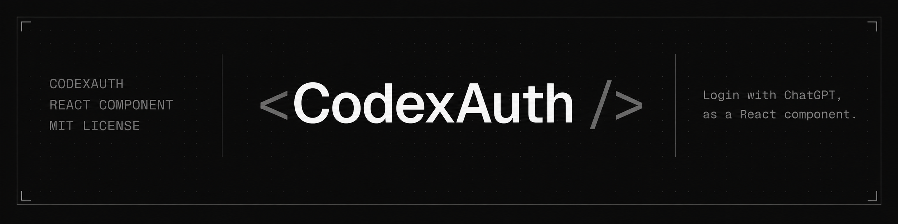
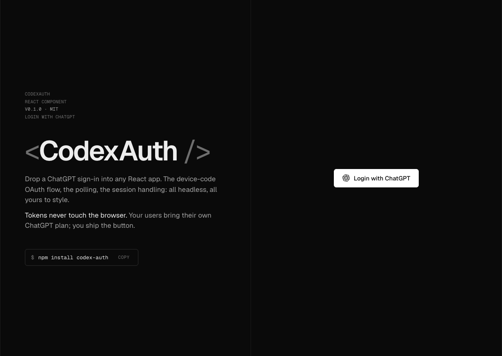
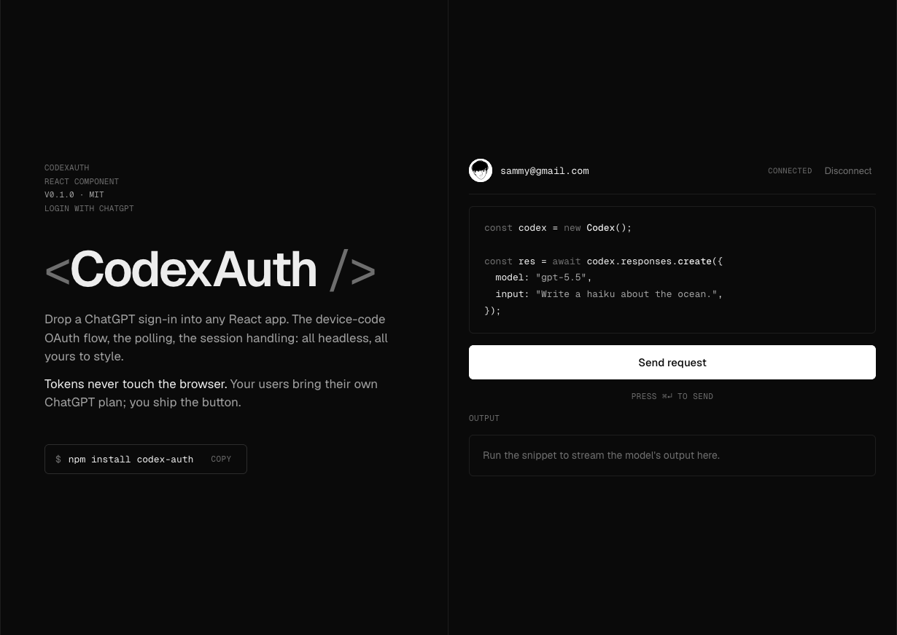

<div align="center">

<!-- Banner: drop a docs/screenshots/banner.png and uncomment the line below.

-->

# `<CodexAuth />`

### Login with ChatGPT, as a React component.

Your users sign in with their own ChatGPT account and run prompts on it.
**You never pay OpenAI** — they use their own plan.

[](https://github.com/AsyncFuncAI/CodexAuth/actions/workflows/ci.yml)
[](https://www.npmjs.com/package/codex-auth)
[](./LICENSE)
[](https://react.dev)

[Quick start](#quick-start) · [Two runners](#pick-a-runner) · [Headless](#headless-usage) · [Deploy](./DEPLOYMENT.md) · [Security](./SECURITY.md)

> ⚠️ **For research & education only.** This uses OpenAI's Codex client off-label
> and likely violates the ChatGPT Terms of Use. **You are solely responsible for
> your use.** [Read the disclaimer ↓](#%EF%B8%8F-disclaimer--read-before-you-use-this)

</div>

<p align="center">
  
</p>

---

## What it is

A headless React component that adds a **"Login with ChatGPT"** button to your app.
Click it, your user approves on `auth.openai.com`, and you can run prompts on their
ChatGPT plan. The OAuth flow, the popup, the polling, the sessions — all handled.

```bash
npm install codex-auth
```

**OAuth tokens never touch the browser.** They live on a backend you control; the
browser only ever sees an `HttpOnly` cookie and the streamed output.

<p align="center">
  
</p>

---

## Quick start

**1. Frontend** — drop in the component:

```tsx
import { CodexAuth } from "codex-auth";

<CodexAuth onAuthenticated={({ account }) => console.log("hi", account)} />
```

**2. Backend** — mount one route (Express shown; Next.js below):

```ts
import { createCodexRouter } from "codex-auth/backend";
import { directRunner } from "codex-auth/backend/direct";

app.use("/api/codex", createCodexRouter({
  runner: directRunner(),
  cookieSecret: process.env.COOKIE_SECRET!,
}));
```

That's it. The component talks to `/api/codex/*` on the same origin by default.

> **One-time, per user:** they enable *device code authorization* in
> **ChatGPT → Settings → Security & Login**. The component shows this hint
> automatically when needed.

---

## Pick a runner

The component is always the same. The **runner** decides how your backend reaches OpenAI:

| Runner | How | Deploys on |
| --- | --- | --- |
| **`directRunner`** | Pure `fetch` to OpenAI. No binary. | **Anywhere — incl. Vercel serverless / edge** |
| **`defaultCliRunner`** | Shells out to the `codex` CLI. | A persistent Node host (Railway, Docker, VPS) |

Both implement the same interface and keep tokens server-side. **`directRunner` is
the recommended default** — frontend + backend can live in one Vercel/Next.js deploy.

### Backend adapters

| Import | For |
| --- | --- |
| `codex-auth/backend` | Express — `createCodexRouter` |
| `codex-auth/backend/next` | Next.js App Router route handler |
| `codex-auth/backend/direct` | the serverless-friendly `directRunner` |
| `codex-auth/backend/worker` | Cloudflare Worker proxy |

<details>
<summary><b>Next.js — one file, zero config</b></summary>

```ts
// app/api/codex/[...codex]/route.ts
import { createNextCodexHandler } from "codex-auth/backend/next";
import { directRunner } from "codex-auth/backend/direct";

export const { GET, POST } = createNextCodexHandler({
  runner: directRunner(),
  cookieSecret: process.env.COOKIE_SECRET!,
});
```

</details>

---

## Headless usage

Pass a function as `children` for full control — no default UI is rendered:

```tsx
<CodexAuth>
  {(auth) =>
    auth.isAuthenticated
      ? <button onClick={auth.logout}>Sign out {auth.account}</button>
      : <button onClick={auth.login}>Login with ChatGPT</button>
  }
</CodexAuth>
```

Run a prompt against the user's account once authenticated:

```tsx
auth.run("Write a haiku about the ocean.", {
  onText: (text) => append(text),
  onDone:  ({ text }) => console.log(text),
});
```

Prefer a hook? `useCodexAuth()` returns the same `auth` object.

---

## How it works

```
Browser <CodexAuth/>          Your backend              OpenAI
   │  click login                 │                        │
   ├── open popup (sync) ─────────┤                        │
   ├── POST /session ────────────▶│                        │
   ├── POST /login/start ────────▶│── device code ───────▶ │
   │  show code, poll status      │◀── loginUrl + code ────│
   │  user approves in popup ───────────────────────────▶  │
   ├── GET /status (poll) ───────▶│◀── tokens (stay here) ─│
   │  authenticated ✓             │                        │
   ├── POST /run/stream ─────────▶│── run prompt ────────▶ │
   │  stream output ◀─────────────│◀── tokens never leave ─│
```

The popup is opened **synchronously** on click (so the blocker allows it), then
redirected to the validated `auth.openai.com` URL once the backend returns it.
Full HTTP spec in [`CONTRACT.md`](./CONTRACT.md).

---

## Run the demo

```bash
git clone https://github.com/AsyncFuncAI/CodexAuth
cd CodexAuth && npm install
cp demo/.env.example demo/.env     # set COOKIE_SECRET
npm run demo                       # app → :5173, backend → :8787
```

---

## Reference

<details>
<summary><b><code>CodexClientConfig</code></b> (component / hook options)</summary>

| Option | Default | Purpose |
| --- | --- | --- |
| `basePath` | `/api/codex` | Base path for the contract |
| `pollIntervalMs` | `3000` | Status poll cadence |
| `resumeMaxAgeMs` | `86_400_000` | Resume a persisted session within 24h |
| `storage` | `localStorage` | Persistence; `null` disables (SSR-safe) |
| `credentials` | `same-origin` | fetch credentials mode |
| `allowedLoginHosts` | `["auth.openai.com"]` | Hosts the login popup may open |
| `enableGravatar` | `false` | Opt-in Gravatar avatar |

`useCodexAuth()` returns: `status`, `account`, `userCode`, `loginUrl`, `error`,
`popupBlocked`, `isAuthenticated` / `isConnecting` / `isWaiting`, `avatarUrl`, and
the actions `login()`, `logout()`, `cancelLogin()`, `run()`, `copyUserCode()`.

</details>

<details>
<summary><b>Cross-origin backends</b></summary>

When the app and backend are on different origins, set `credentials: 'include'`
on the client and pass `allowedOrigins: ['https://your-app.example']` to the
router (it emits credentialed CORS for that specific origin, never `*`).

</details>

---

## ⚠️ Disclaimer — read before you use this

> **This project is for education and research. You alone are responsible for how you use it.**

`<CodexAuth>` reuses OpenAI's **first-party Codex CLI** OAuth client and talks to
undocumented Codex endpoints off-label. **This very likely violates OpenAI's Terms
of Use.** OpenAI's ChatGPT plans explicitly prohibit, among other things:

> - *Abusive usage, such as automatically or programmatically extracting data.*
> - *Sharing your account credentials or making your account available to anyone else.*
> - **Reselling access or using ChatGPT to power third-party services.**
>
> — [OpenAI Help Center, "Access and usage allowances"](https://help.openai.com/en/articles/8983719-what-is-chatgpt-pro)

Using this to power an app for other users falls squarely under that last point.

**By using this software, you acknowledge that:**

- You are **solely responsible** for ensuring your use complies with OpenAI's
  [Terms of Use](https://openai.com/policies/row-terms-of-use/) and Usage Policies.
- It may get **your account, your users' accounts, or the shared OAuth client
  rate-limited, suspended, or banned**, at OpenAI's discretion.
- The undocumented endpoints can **change or break at any time** with no notice.
- The authors provide this **as-is, with no warranty**, and accept **no liability**
  for any consequence of its use (see the [MIT License](./LICENSE)).

**Do not build a product or business on this.** For anything real, use the
[official OpenAI API](https://platform.openai.com) with your own key, or have each
user bring their own key. See [`SECURITY.md`](./SECURITY.md) for the full trust model.

---

<div align="center">

**MIT** · Not affiliated with or endorsed by OpenAI · For research & education only

</div>
