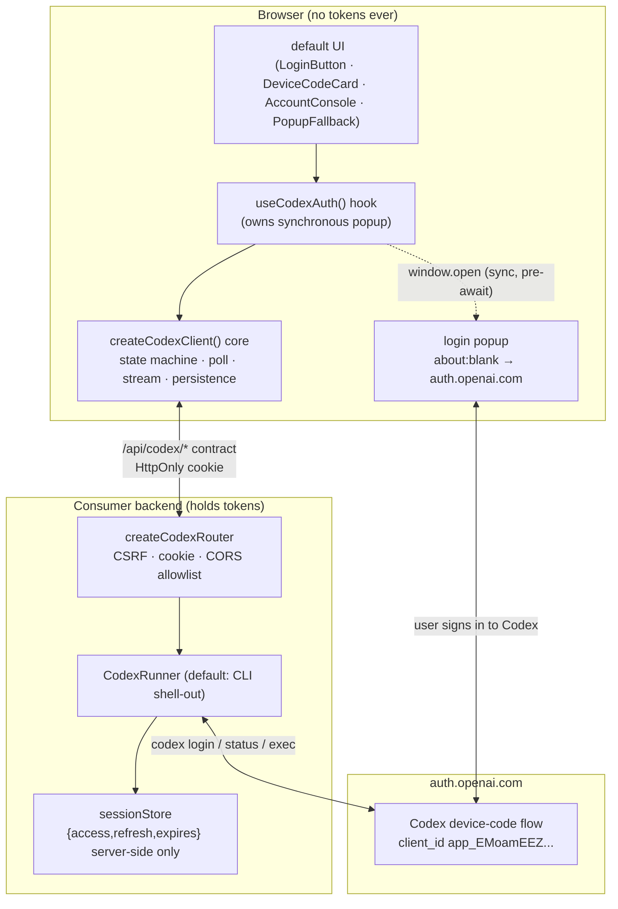
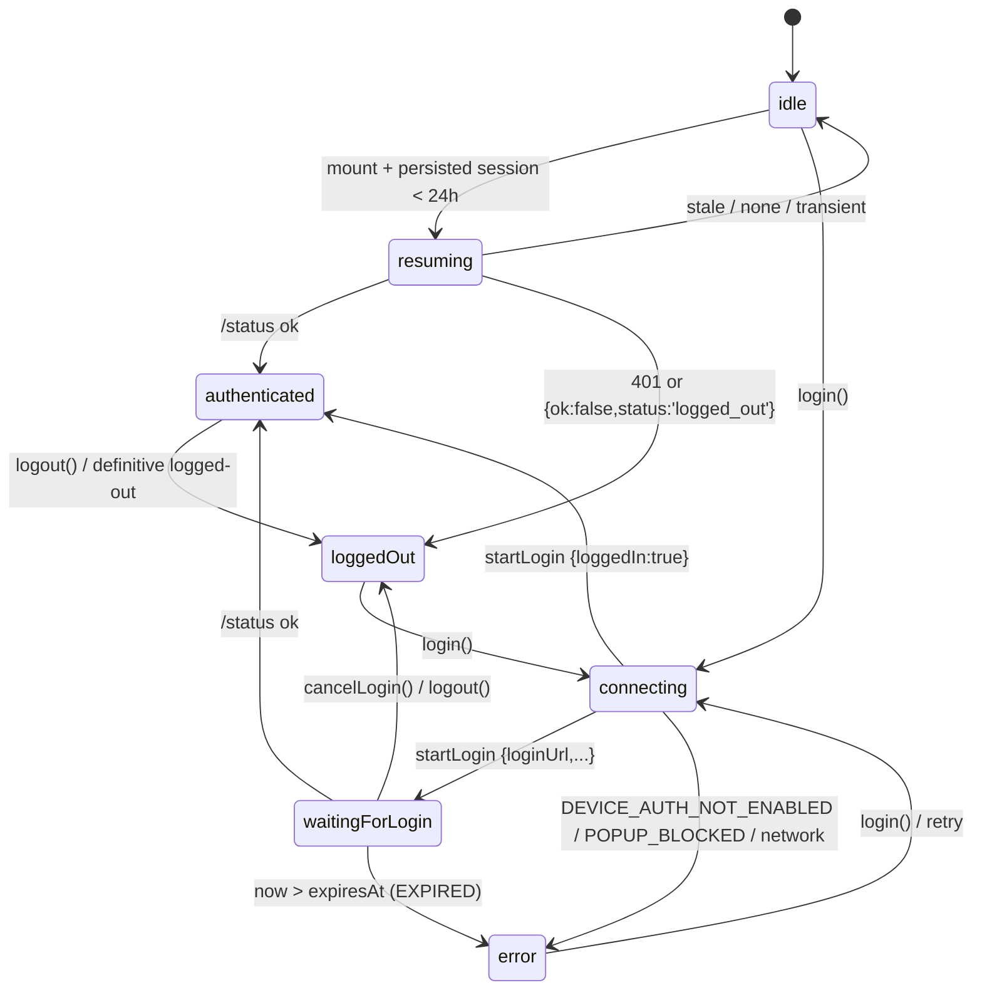
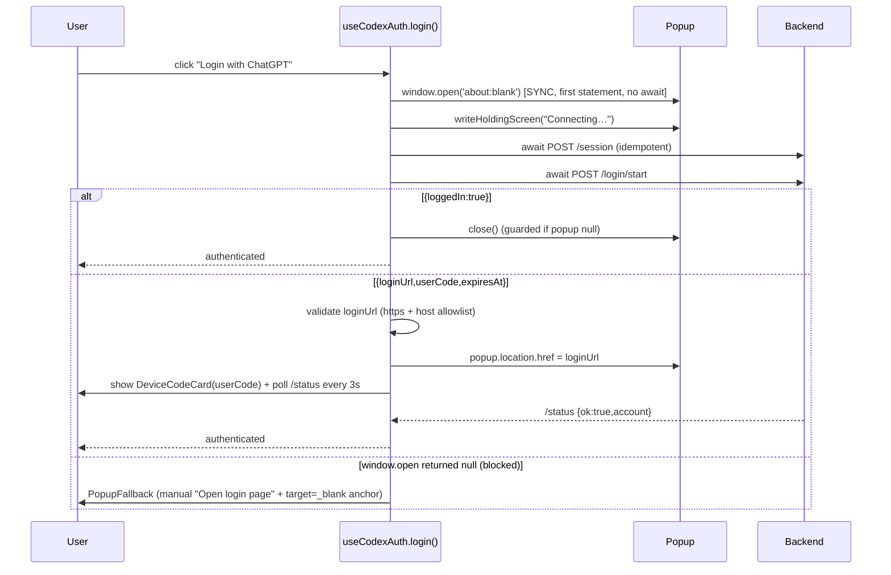

# feat: `<CodexAuth>` — open-source Login-with-ChatGPT React component

## Summary

Ship an open-source React + npm package, `<CodexAuth>`, that reproduces the first version of
[login-with-chatgpt.vercel.app](https://login-with-chatgpt.vercel.app/) as a reusable component — a
"Login with ChatGPT" button that lets a site's users authenticate with their **personal ChatGPT account**
and run prompts on it, so the site owner never pays OpenAI for usage.

The architecture is a **device-code proxy**: OAuth tokens never enter the browser. A consumer-provided
backend runs the real Codex CLI device-code flow and exposes a small HTTP contract (`/api/codex/*`). The
component owns the browser UX (synchronous-blank-popup, device-code card, status polling, account console)
and talks only to that contract. We ship a runnable **Node/Express reference backend** that shells out to
the official Codex CLI, plus a runnable demo.

This plan targets a **new greenfield repo** at the current working directory (`codexauth`). The goal is
speed-to-ship matching the live site's v1, with the adversarial-review security fixes baked in from the
start (CSRF, cookie hardening, opt-in Gravatar, bounded NDJSON parsing, token-confinement guard tests).

---

## Problem Frame

OpenAI's official Codex CLI authenticates against `auth.openai.com` using a public OAuth client
(`client_id app_EMoamEEZ73f0CkXaXp7hrann`, `codex_cli_simplified_flow=true`). Because that client is public
and the flow is PKCE/device-code, **any** application can run the same login and obtain a token bound to the
end-user's own ChatGPT plan — the user's account pays for usage, not the app owner. Savio (@saviomartin7)
demonstrated this at login-with-chatgpt.vercel.app and is publicly weighing whether to open-source it. We
are building the reusable component now.

**The verified mechanics (ground truth — do not re-research):**

- **Live site browser behavior** (read verbatim from `app.js`, confirmed by clicking the live button):
  - On click, open a **blank popup synchronously inside the click handler, before any `await`** (the only
    way to survive the popup blocker), show a "Connecting…" holding screen, then point the popup at the
    device-code `loginUrl` once the backend returns it.
  - Backend HTTP contract the browser calls: `POST /api/codex/session`, `POST /api/codex/login/start`,
    `GET /api/codex/status` (polled every 3000ms), `POST /api/codex/run/stream` (NDJSON), `POST /api/codex/logout`.
  - `/login/start` returns `{ loginUrl, userCode, expiresAt }` (or `{ ok:true, loggedIn:true }`, or
    `{ errorCode: "DEVICE_AUTH_NOT_ENABLED" }`). The browser shows the `userCode` (e.g. `BNPY-MZ5DA`) with
    copy-to-clipboard and first-timer helper text ("enable device code authorization in ChatGPT Settings →
    Security & Login").
  - `/run/stream` request body is **`{ prompt: string }`** (verified: `app.js` sends
    `JSON.stringify({ prompt: input })`). Stream events: `{type:"assistant-text", mode:"append"|"replace", text}`,
    `{type:"done", result:{text}}`, `{type:"error", error}`.
  - Session persistence: `localStorage` key, resume if saved within 24h, then verify via `/status`; tolerate
    5xx/network blips; re-poll immediately on `visibilitychange → visible`.
  - The OpenAI consent popup reads "continue to **Codex**" — confirming reuse of the official Codex CLI client.

- **The OAuth "secret sauce"** (read verbatim from `PinataCloud/ipfs-cli` `internal/agents/codex_oauth.go`) —
  relevant to the **reference backend** only: client_id `app_EMoamEEZ73f0CkXaXp7hrann`,
  authorize `https://auth.openai.com/oauth/authorize`, token `https://auth.openai.com/oauth/token`,
  scope `openid profile email offline_access`, params `id_token_add_organizations=true` +
  `codex_cli_simplified_flow=true`, PKCE S256 (verifier 32 bytes base64url, challenge SHA256(verifier),
  state 16 bytes), token bundle `{access_token, refresh_token, expires_at}`.

**Why a backend is mandatory:** the device-code flow shells out to the official Codex CLI binary
(`codex login`, status, `codex exec`), which needs `child_process` + filesystem. Cloudflare Workers cannot
spawn it, so a Node runtime is the only portable reference that implements the full flow end-to-end. Tokens
live in the backend's session store, never in the browser.

---

## Scope Boundaries

### In scope (v1 — match the live site's first version)
- A single React-only npm package (no monorepo) with a framework-agnostic TS core inside it.
- Headless `useCodexAuth()` hook + `<CodexAuth>` component with a default styled UI (button, Connecting/Waiting
  screens, device-code card, account console, popup-blocked fallback).
- Pluggable HTTP contract (`basePath` default `/api/codex`, per-route overrides, injectable `fetch`).
- A runnable Node/Express **reference backend** (`createCodexRouter` + a CLI-shell-out `CodexRunner`) with
  CSRF + cookie hardening + CORS allowlist baked in.
- A runnable demo (Vite app + Express server) wired end-to-end.
- README with copy-paste quickstart, headless example, config reference, and a versioned `CONTRACT.md`.
- Smoke-level tests for the load-bearing/security-sensitive pieces (state machine, NDJSON parser, poll logic,
  token-confinement guard, CSRF/CORS rejection).
- MIT license, npm publishability hygiene (`files`, `exports` map, `sideEffects`, `'use client'`).

### Deferred to Follow-Up Work
- `run()` chat-execution client lives behind a **separate `./run` subpath export**, not the core auth surface
  (keeps the auth API minimal). It is implemented in v1 because the demo needs it, but it is not part of the
  default `<CodexAuth>` import.
- Cloudflare Worker edge variant — documented as a README note (reverse-proxy to a Node device-runner), no code.
- Direct device-code-grant backend (no CLI shell-out, implementing PKCE against `auth.openai.com` directly) —
  the `CodexRunner` interface leaves room for it; not implemented in v1.
- `attw`/`publint` dual-package CI validation, full CI matrix across React 17/18/19 — a basic CI workflow ships;
  the exhaustive matrix is follow-up.
- Token refresh signaling — fully internal to the backend; the contract never exposes a refresh path.
- Rate limiting on `/login/start` and `/run/stream` — ship a documented pluggable hook + README warning, not a
  built-in limiter.

### Non-goals (outside this component's identity)
- Persisting or exposing OAuth tokens to the browser in any form.
- A hosted multi-tenant service / sandbox-VM-per-user infrastructure (the live demo runs server-side VMs; the
  open-source component ships the contract + a single-process reference backend, not the VM orchestration).
- Supporting auth providers other than ChatGPT/Codex.

---

## Key Technical Decisions

### KTD1 — Device-code proxy, tokens server-side only
Mirror the live site exactly: the browser never sees `access_token`/`refresh_token`. The component talks to a
backend over the `/api/codex/*` contract; the backend holds the token bundle. This is the whole security model
and is asserted by a guard test (U10). *Rationale: matches the verified live architecture; the alternative
(in-browser PKCE) would leak a refresh_token into the browser — see Alternatives.*

### KTD2 — Three layers in one package: core / hook / component
`createCodexClient()` (framework-agnostic store: `subscribe`/`getState`/`destroy` + actions) → `useCodexAuth()`
(thin React binding) → `<CodexAuth>` (render-prop headless API + default UI fallback). *Rationale: headless-first
maximizes reuse; the hook stays a thin binding so the logic is testable without React.*

### KTD3 — Synchronous-blank-popup, opened before any await
`login()`'s **first statement** is `window.open('about:blank', 'codex-login', 'popup,...')`, then write a
holding screen, *then* `await ensureSession()`/`startLogin()`, then point the popup at `loginUrl`. *Rationale:
the only reliable way past the popup blocker (verified from `app.js`). The loginUrl isn't known until after the
await, which is exactly why the popup opens blank first.*

### KTD4 — `/run/stream` body is `{ prompt }`, not `{ input }`
Verified from `app.js`. The design draft assumed `{ input }`; this plan corrects it. The hook's `run()` API may
take `input` as its JS parameter name, but the wire body field is `prompt`.

### KTD5 — Logged-out signal is explicit, not HTTP-401-only
`/status` returns `200 {ok:false, status?}` for the not-yet-authenticated case. A persisted session is treated
as **definitively logged out** when `/status` responds `401` **or** `200 {ok:false, status:'logged_out'}`. A
plain `200 {ok:false}` (pending/transient) keeps polling/tolerating; it does **not** sign out. *Rationale:
review found the "401-only" rule can never fire for a server-expired session and would wedge the client.*

### KTD6 — `/session` is idempotent and always called; no client-side cookie check
The session cookie is `HttpOnly`, so `document.cookie` cannot see it; "call `/session` only if no cookie" is
impossible. `ensureSession()` always calls `POST /session`, which the backend makes idempotent. *Rationale:
review caught the un-implementable check.*

### KTD7 — Cookie + CSRF + CORS hardening in the reference router
Session cookie is `HttpOnly + Secure + SameSite=Strict + signed`, regenerated on successful login (session
fixation). All POST endpoints enforce an `Origin`/`Sec-Fetch-Site` check (same-origin) and/or a double-submit
CSRF token. Cross-origin requires an explicit `allowedOrigins` allowlist; the router **never** reflects an
arbitrary Origin with `Access-Control-Allow-Credentials: true`. Default `credentials: 'same-origin'` — never
`'include'` by default. *Rationale: the contract is cookie-authenticated; without this it is classically CSRF-forgeable.*

### KTD8 — Gravatar is opt-in (`enableGravatar={false}` default) and uses MD5
The live site hashes the email with SHA-256, which **never resolves** against gravatar.com (Gravatar requires
MD5) and leaks an email hash to a third party on every render. We default the feature **off**, and when enabled
use a tiny MD5 + a secure-context guard, falling back to the initial-letter avatar. *Rationale: review caught a
dead-on-arrival feature + a privacy footgun.*

### KTD9 — Bounded, fault-tolerant NDJSON stream reader
`stream.ts` caps max line length (reject/emit `RUN_FAILED` past the cap), wraps each `JSON.parse` in try/catch
(skip malformed line, don't abort the run), and defines EOF-without-trailing-newline behavior. *Rationale:
review flagged unbounded-buffer DoS + undefined malformed-line behavior.*

### KTD10 — `loginUrl` is validated before navigation
Before `popupRef.location.href = loginUrl`, assert `https:` scheme and (configurable allowlist, default
`auth.openai.com`) host; reject `javascript:`/`http:`. *Rationale: a compromised backend response could
otherwise navigate the popup anywhere under the auth UX.*

---

## High-Level Technical Design

### Component / layer architecture



### Auth state machine



### Login popup sequence (the secret sauce)



---

## Output Structure

```
codexauth/
├── package.json                      # exports map (. / ./run / ./backend), files:['dist'], sideEffects, peerDeps
├── tsconfig.json
├── tsup.config.ts                    # multi-entry: index, run, backend
├── vitest.config.ts                  # jsdom + ReadableStream/TextDecoder polyfills
├── eslint.config.js
├── LICENSE                           # MIT
├── README.md
├── CONTRACT.md                       # versioned HTTP contract spec for other-language backends
├── SECURITY.md                       # trust model, CSRF stance, cross-origin checklist
├── .github/workflows/ci.yml          # build + typecheck + test
├── src/
│   ├── index.ts                      # public barrel (auth only; no run())
│   ├── run.ts                        # ./run subpath: run()/RunController/stream client
│   ├── core/
│   │   ├── createCodexClient.ts
│   │   ├── stateMachine.ts
│   │   ├── contract.ts
│   │   ├── endpoints.ts
│   │   ├── poll.ts
│   │   ├── stream.ts
│   │   ├── persistence.ts
│   │   ├── popup.ts
│   │   ├── gravatar.ts               # MD5, opt-in
│   │   └── md5.ts                    # tiny MD5 (SubtleCrypto has no MD5)
│   ├── react/
│   │   ├── useCodexAuth.ts           # 'use client'
│   │   ├── CodexAuth.tsx             # 'use client'
│   │   └── ui/ (LoginButton · DeviceCodeCard · AccountConsole · PopupFallback · styles)
│   └── backend/                      # ./backend subpath, node-only, never in browser bundle
│       ├── express/ (createCodexRouter · cliRunner · sessionStore · csrf · cors)
│       └── types.ts                  # CodexRunner interface
├── demo/
│   ├── app/ (App.tsx · main.tsx)
│   ├── server/index.ts
│   ├── vite.config.ts                # proxy /api/codex → demo server
│   └── .env.example                  # COOKIE_SECRET, CODEX_BIN
└── tests/ (stateMachine · poll · stream · persistence · popup · useCodexAuth · backend.router · csrf-cors · token-confinement)
```

The per-unit `**Files:**` lists below are authoritative; the implementer may adjust layout if a better one emerges.

---

## Implementation Units

### U1. Package scaffold + build/test tooling
**Goal:** A publishable, buildable, type-checked empty package skeleton with the correct `exports` map and npm hygiene.
**Requirements:** Enables every later unit; npm publishability (KTD).
**Dependencies:** none.
**Files:** `package.json`, `tsconfig.json`, `tsup.config.ts`, `vitest.config.ts`, `eslint.config.js`, `LICENSE`, `.github/workflows/ci.yml`, `.gitignore`, `src/index.ts` (stub).
**Approach:** React-only package, `peerDependencies` `react`/`react-dom` `>=17`. `exports` map with three subpaths:
`.` (browser, auth only), `./run` (browser, run client), `./backend` (node condition only — `child_process`/`express`
must never resolve into the browser bundle). `files: ['dist']`. `sideEffects: ['**/*.css', './dist/ui*']` so injected
styles survive tree-shaking. tsup multi-entry → ESM + CJS + `.d.ts`. Vitest with jsdom and `ReadableStream`/`TextDecoder`
polyfills for the stream tests. Basic CI: install → typecheck → build → test.
**Patterns to follow:** standard tsup + vitest dual-package layout.
**Test scenarios:** `Test expectation: none — scaffolding/config unit. Verified by U1 verification (build + typecheck succeed).`
**Verification:** `npm run build` emits `dist/` with `.js`/`.cjs`/`.d.ts` for all three entries; `npm run typecheck` passes; CI workflow is valid.

### U2. HTTP contract types + endpoint resolution
**Goal:** The single source of truth for the `/api/codex/*` contract as TypeScript types, plus `resolveEndpoints(config)`.
**Requirements:** KTD1, KTD4; consumed by every core unit.
**Dependencies:** U1.
**Files:** `src/core/contract.ts`, `src/core/endpoints.ts`, `CONTRACT.md`, test `tests/endpoints.test.ts`.
**Approach:** Define `SessionResponse`, `LoginStartResponse` (`{ok:true,loggedIn?:true} | {loginUrl,userCode,expiresAt} | {errorCode:'DEVICE_AUTH_NOT_ENABLED'} | {error}`),
`StatusResponse` (`{ok:true,account} | {ok:false,status?,error?}`), `RunStreamEvent`, `LogoutResponse`, `EndpointMap`,
`CodexClientConfig`. **`/run/stream` request body type is `{ prompt: string }`** (KTD4). Pin `expiresAt` unit explicitly
as **absolute epoch milliseconds** in a doc comment (review flagged off-by-1000 risk). `resolveEndpoints` merges
`basePath` (default `/api/codex`) with `Partial<EndpointMap>` overrides where each provided value **replaces the derived
path verbatim** (absolute URL or relative path — supports cross-origin); document precedence. `CONTRACT.md` documents
each route for other-language backend authors.
**Patterns to follow:** discriminated unions for response shapes.
**Test scenarios:**
- Default `basePath` produces `/api/codex/session`, `/api/codex/login/start`, `/api/codex/status`, `/api/codex/run/stream`, `/api/codex/logout`.
- A single `endpoints.status` override (absolute URL) replaces only `status`; the rest stay basePath-derived.
- A relative override is used verbatim.
- Custom `basePath` (e.g. `/codex`) is reflected in all five.
**Verification:** types compile; `CONTRACT.md` lists all five routes with request/response shapes; tests pass.

### U3. Pure auth state machine
**Goal:** A pure, I/O-free reducer implementing the state diagram above; the brain of the client.
**Requirements:** KTD2, KTD5.
**Dependencies:** U2.
**Files:** `src/core/stateMachine.ts`, test `tests/stateMachine.test.ts`.
**Approach:** `CodexAuthStatus = 'idle'|'resuming'|'connecting'|'waitingForLogin'|'authenticated'|'error'|'loggedOut'`.
`CodexAuthSnapshot` carries `status, account, userCode, loginUrl, expiresAt, popupBlocked, error`. `transition(state, event)`
returns the next snapshot. Keep `idle` vs `loggedOut` distinct (never-authed vs explicitly-signed-out) but document they
render identically in the default button. No timers, no fetch — events are injected by the core.
**Patterns to follow:** pure reducer; exhaustive `switch` on event type.
**Test scenarios:**
- Every transition in the state diagram (happy path: idle→connecting→waitingForLogin→authenticated).
- `connecting` + `{loggedIn:true}` → `authenticated` (skips waiting).
- `connecting` + `DEVICE_AUTH_NOT_ENABLED` → `error` with that code.
- `connecting` + popup-blocked → `error` code `POPUP_BLOCKED`.
- `waitingForLogin` + `now > expiresAt` → `error` code `EXPIRED`.
- `waitingForLogin` + `cancelLogin` → `loggedOut`.
- `resuming` + definitive-logged-out → `loggedOut`; `resuming` + transient → `idle`.
- Edge: unknown event leaves state unchanged.
**Verification:** 100% of diagram transitions covered; reducer is referentially transparent (same input → same output).

### U4. NDJSON stream reader (bounded + fault-tolerant)
**Goal:** Parse the `/run/stream` NDJSON body safely.
**Requirements:** KTD9.
**Dependencies:** U2.
**Files:** `src/core/stream.ts`, test `tests/stream.test.ts`.
**Approach:** Read the fetch `ReadableStream`, decode with `TextDecoder({stream:true})`, split on `\r?\n`, buffer the
partial trailing line. **Cap max line length** (configurable, sane default); exceeding it emits a `RUN_FAILED` and aborts.
Each line: `try { JSON.parse }` → dispatch `assistant-text`(append|replace)/`done`/`error`; a malformed line is **skipped**
(not fatal). At EOF, flush a non-empty trailing buffer through the same parse path. Support reader cancellation.
**Patterns to follow:** the live `app.js` `streamJsonLines` loop, hardened.
**Test scenarios:**
- Multiple `assistant-text` append events accumulate in order.
- `mode:'replace'` replaces accumulated text.
- A line split across two chunks is buffered and parsed once whole.
- A malformed JSON line is skipped; subsequent valid lines still dispatch.
- EOF without trailing newline flushes the final event.
- A line exceeding max length emits `RUN_FAILED` and stops.
- `error` event surfaces a distinct stream-error (not conflated with transport failure).
**Verification:** all scenarios pass under Node with the polyfilled `ReadableStream`.

### U5. Status poller (tolerant, reentrancy-guarded)
**Goal:** Poll `/status` correctly per the verified behavior, with the review's robustness fixes.
**Requirements:** KTD5.
**Dependencies:** U2, U3.
**Files:** `src/core/poll.ts`, test `tests/poll.test.ts`.
**Approach:** Poll every `pollIntervalMs` (default 3000) while `waitingForLogin`/`resuming`. Stop once `now > expiresAt`
(→ `EXPIRED`). **Reentrancy guard** (in-flight flag) so an interval tick + a `visibilitychange` re-poll never overlap.
**Bounded backoff** on consecutive 5xx/network errors with a failure ceiling → `error('STATUS_FAILED')` (don't poll a
dead backend forever). Immediate **debounced** re-poll on `visibilitychange → visible`. Sign out only on the definitive
logged-out signal (KTD5), never on a plain `{ok:false}`. `startPolling()` is idempotent (returns existing stop fn if
already running).
**Patterns to follow:** `app.js` `pollCodexLoginStatus` + visibilitychange handler, hardened.
**Test scenarios:** (fake timers)
- Polls at 3000ms cadence until `{ok:true}` then stops.
- Stops and emits `EXPIRED` once past `expiresAt`.
- `200 {ok:false}` (pending) keeps polling, does NOT sign out.
- `401` (or `{ok:false,status:'logged_out'}`) signs out.
- 5xx blips are tolerated; N consecutive failures → `STATUS_FAILED`.
- `visibilitychange → visible` triggers an immediate poll; rapid toggles are debounced.
- Overlapping interval tick + visibility re-poll do not double-fire (reentrancy guard).
**Verification:** all scenarios pass with mocked fetch + fake timers.

### U6. Session persistence (resume + verify)
**Goal:** 24h `localStorage` resume that verifies before trusting, SSR-safe.
**Requirements:** KTD5; live-site resume behavior.
**Dependencies:** U2, U3, U5.
**Files:** `src/core/persistence.ts`, test `tests/persistence.test.ts`.
**Approach:** Injectable `storage` (default `localStorage`, `null` disables → SSR-safe), key default `codex-auth:session`.
Persist `{loggedIn, savedAt}` and optionally `account` — **prefer NOT persisting the email** (re-fetch from `/status` on
resume) to avoid plaintext PII in `localStorage` (review note); make persisting account opt-in. On resume: if `savedAt`
within `resumeMaxAgeMs` (default 24h) → `resuming` → verify via `/status`; sign out only on definitive logged-out; tolerate
transient errors (keep cached session, don't wipe on a blip). Guard all `window`/`localStorage` access.
**Patterns to follow:** `app.js` `resolveState`/`verifyResumedSession`.
**Test scenarios:**
- Fresh session (`savedAt` < 24h) → `resuming`, then `/status ok` → `authenticated`.
- Stale session (> 24h) → cleared → `idle`.
- Resume + definitive logged-out → cleared → `loggedOut`.
- Resume + 5xx → keeps cached session (no wipe), retries.
- `storage: null` → no throw, behaves as no-persistence (SSR).
**Verification:** all scenarios pass with mock storage + fetch.

### U7. Popup helper + loginUrl validation
**Goal:** The synchronous-blank-popup primitives and URL safety.
**Requirements:** KTD3, KTD10.
**Dependencies:** U1.
**Files:** `src/core/popup.ts`, test `tests/popup.test.ts`.
**Approach:** `openBlankPopup()` = synchronous `window.open('about:blank','codex-login','popup,width=520,height=720')`
returning the ref or `null`. `writeHoldingScreen(ref)` writes static, trusted "Connecting…" HTML (never interpolate server
data — XSS sink). `pointPopupTo(ref, url)` first calls `assertSafeLoginUrl(url)` (https scheme + host allowlist default
`auth.openai.com`, reject `javascript:`/`http:`), then sets `ref.location.href`. `closePopup(ref)` is null-guarded.
`isClosed(ref)` for manual-close detection (guarded against the cross-origin transition race where `.closed` can throw).
**Patterns to follow:** `app.js` `openLoginPopup`/`writePopupLoading`/`sendPopupToLogin`.
**Test scenarios:**
- `assertSafeLoginUrl` accepts `https://auth.openai.com/...`; rejects `http:`, `javascript:`, and off-allowlist hosts.
- `closePopup(null)` does not throw.
- `writeHoldingScreen` output contains no interpolated input.
**Verification:** URL validation rejects all unsafe schemes/hosts; helpers are null-safe.

### U8. Core client — `createCodexClient()`
**Goal:** Wire U2–U7 into a framework-agnostic store with actions.
**Requirements:** KTD2, KTD6.
**Dependencies:** U2, U3, U4, U5, U6, U7.
**Files:** `src/core/createCodexClient.ts`, test `tests/createCodexClient.test.ts`.
**Approach:** `subscribe(cb)`/`getState()`/`destroy()` store over the state machine. Actions: `ensureSession()`
(**always** `POST /session`, idempotent — KTD6), `startLogin()` (`POST /login/start`, maps responses to events),
`pollStatus()`/`startPolling()`, `logout()` (`POST /logout`; clears persistence + sets `loggedOut` **even if the request
fails** so the UI never looks logged-in after click), `cancelLogin()` (leave `waitingForLogin` without a backend logout),
`resumeFromStorage()`, `run()` (delegates to the `./run` client). Injectable `fetch`; `credentials` default `same-origin`.
`destroy()` tears down pollers, listeners, and any open popup ref.
**Patterns to follow:** standard external-store (`subscribe`/`getSnapshot`) shape compatible with `useSyncExternalStore`.
**Test scenarios:**
- `ensureSession()` always POSTs `/session` (no client-side cookie check).
- `startLogin()` `{loginUrl,...}` → state `waitingForLogin` + polling started.
- `startLogin()` `{loggedIn:true}` → `authenticated`, popup closed.
- `logout()` clears persistence + state even when `/logout` rejects.
- `cancelLogin()` → `loggedOut` without calling `/logout`.
- `destroy()` stops pollers and removes listeners (no leaks).
**Verification:** all scenarios pass with mocked fetch; no dangling timers after `destroy()`.

### U9. React hook + `<CodexAuth>` component + default UI
**Goal:** The React surface: `useCodexAuth()`, `<CodexAuth>` (render-prop + default UI), and the styled subcomponents.
**Requirements:** KTD2, KTD3, KTD8.
**Dependencies:** U8.
**Files:** `src/react/useCodexAuth.ts`, `src/react/CodexAuth.tsx`, `src/react/ui/LoginButton.tsx`,
`src/react/ui/DeviceCodeCard.tsx`, `src/react/ui/AccountConsole.tsx`, `src/react/ui/PopupFallback.tsx`,
`src/react/ui/styles.css.ts`, `src/core/gravatar.ts`, `src/core/md5.ts`, test `tests/useCodexAuth.test.tsx`.
**Approach:** `'use client'` banner on the hook + component (Next.js App Router). The hook **stabilizes the client**:
create it once (memo/ref keyed on a stable config or an explicitly-passed `client`); document that inline config literals
must not recreate it every render (review footgun). `login()` opens the blank popup **synchronously as its first
statement** before awaiting, and is **single-flight guarded** (ignore if status is `connecting`/`waitingForLogin`) to avoid
orphaned popups under StrictMode double-invoke. Unmount/`destroy()` closes any open popup. `<CodexAuth>`: if `children` is
a function → render-prop (full hook result, no default UI); else render the default UI. `onAuthenticated` receives an
**object** (`{account}`) not a bare string (forward-compat). Gravatar avatar (U: `gravatar.ts`+`md5.ts`) is **opt-in**
(`enableGravatar={false}` default), MD5-hashed, secure-context-guarded, initial-letter fallback. Default UI renders
assistant/account text as **plain text** (no `dangerouslySetInnerHTML`). `PopupFallback` handles the interim state where
`popupBlocked` is true but `loginUrl` is still null (spinner → then reveal `target=_blank rel="noopener noreferrer"` anchor).
`copyUserCode()` fails gracefully where `navigator.clipboard` is unavailable.
**Patterns to follow:** `app.js` UX states (Connecting… / Waiting for login… / device-code card / console); render-prop +
default-UI composition.
**Test scenarios:** (RTL + mocked backend)
- Click opens a (mocked) popup **synchronously** before the network await resolves.
- Double-click / StrictMode double-invoke does not open two popups (single-flight).
- `{loginUrl,userCode}` → DeviceCodeCard shows `userCode` + copy; popup pointed at loginUrl.
- Blocked popup (`window.open`→null) → PopupFallback with anchor once `loginUrl` known.
- End-to-end mocked login → `authenticated` → AccountConsole with account; Logout → `loggedOut`.
- `children` as function → no default UI rendered; receives full state.
- Gravatar off by default (no gravatar.com request); on → MD5 hash, initial-letter fallback in insecure context.
- Assistant/account text is escaped (no HTML injection).
**Verification:** all scenarios pass; no orphaned popups; no token field present in any state exposed to React.

### U10. Reference Express backend + token-confinement guard
**Goal:** A runnable Node/Express backend implementing the 5 endpoints with CSRF/cookie/CORS hardening, plus the
invariant test that tokens never reach the browser.
**Requirements:** KTD1, KTD7; security notes.
**Dependencies:** U2.
**Files:** `src/backend/express/createCodexRouter.ts`, `src/backend/express/cliRunner.ts`,
`src/backend/express/sessionStore.ts`, `src/backend/express/csrf.ts`, `src/backend/express/cors.ts`,
`src/backend/types.ts`, tests `tests/backend.router.test.ts`, `tests/csrf-cors.test.ts`, `tests/token-confinement.test.ts`.
**Approach:** `createCodexRouter({ runner, cookieSecret, sessionStore?, cookieName?, cookieOptions?, allowedOrigins?, csrf? })`
mounts `POST /session`, `POST /login/start`, `GET /status`, `POST /run/stream`, `POST /logout`. Cookie: `HttpOnly + Secure +
SameSite=Strict + signed`, **regenerated on successful login** (session fixation). CSRF: `Origin`/`Sec-Fetch-Site`
same-origin check on all POSTs and/or double-submit token. CORS: no handling unless `allowedOrigins` is set; for listed
origins emit `Access-Control-Allow-Credentials: true` + the **specific** origin (never `*`, never reflect arbitrary);
unlisted credentialed cross-origin is refused. `CodexRunner` interface: `startDeviceLogin`/`getStatus`/`run`/`logout`.
`defaultCliRunner` shells out to the official Codex CLI (`codex login` device flow → parse `loginUrl`+`userCode`; status;
`codex exec` → NDJSON), **sanitizing stderr** so tokens/paths the CLI may print never reach the client; kills the child on
client disconnect (`req.on('close')`). `sessionStore` (in-memory, pluggable) holds `{access,refresh,expires}` **server-side
only**; never serialized into any response. `.env.example` documents `COOKIE_SECRET` (env-sourced, min entropy) + `CODEX_BIN`.
**Patterns to follow:** Pinata `codex_oauth.go` device/PKCE constants for a future direct-grant runner; the live contract.
**Test scenarios:**
- (supertest, mock runner) All 5 endpoints round-trip with a valid signed cookie.
- `POST /session` is idempotent (second call reuses session).
- `/login/start` maps runner outputs to `{loginUrl,...}` / `{loggedIn:true}` / `{errorCode:'DEVICE_AUTH_NOT_ENABLED'}`.
- `/status` returns only `{ok,account}` — never any token field.
- CSRF: a POST with a foreign `Origin`/`Sec-Fetch-Site: cross-site` is rejected (403).
- CORS: credentialed request from an unlisted origin is refused; a listed origin gets the specific-origin header (never `*`).
- **Token-confinement (guard):** assert NO response body (session/login-start/status/run/logout) and no error/stream-error
  payload ever contains `access_token`/`refresh_token`/`expires_at`, even when the runner holds them.
- Cookie carries `HttpOnly; Secure; SameSite=Strict`; rotates on successful login.
**Verification:** supertest suite green; token-confinement test fails if a runner leaks a token; CSRF/CORS rejections fire.

### U11. Runnable demo (Vite app + Express server)
**Goal:** An end-to-end demo a developer can run to see the flow, mirroring the live site.
**Requirements:** validates U9 + U10 together.
**Dependencies:** U9, U10.
**Files:** `demo/app/App.tsx`, `demo/app/main.tsx`, `demo/server/index.ts`, `demo/vite.config.ts`, `demo/.env.example`.
**Approach:** Vite React app showing both default-UI usage and a restyled headless render-prop usage + a prompt box using
the `./run` client. `demo/server/index.ts` wires `createCodexRouter` + `defaultCliRunner` at `/api/codex`. Vite dev proxy
forwards `/api/codex` → the demo server. README documents `npm run demo`.
**Patterns to follow:** the live site's split layout (hero + console).
**Test scenarios:** `Test expectation: none — demo/integration harness. Manual verification per U11 verification.`
**Verification:** `npm run demo` boots both; clicking "Login with ChatGPT" opens the popup, shows a device code, and (with
a real Codex CLI + device auth enabled) reaches the authenticated console and streams a prompt response. Document the
manual smoke steps in README.

### U12. README, CONTRACT.md, SECURITY.md, CHANGELOG.md
**Goal:** The docs that make this usable and publishable.
**Requirements:** open-source distribution.
**Dependencies:** U1–U11 (documents their surfaces).
**Files:** `README.md`, `CONTRACT.md` (expanded from U2), `SECURITY.md`, `CHANGELOG.md`.
**Approach:** README: one-paragraph pitch (matches the live site), install, copy-paste default-UI quickstart, headless
render-prop example, full `CodexClientConfig` reference, backend setup (Express + Codex CLI prerequisites + enabling device
auth in ChatGPT Settings → Security & Login), popup-strategy explainer, and the security defaults. `SECURITY.md`: trust
model (where tokens live, why `same-origin` default, CSRF stance, cross-origin hardening checklist, "don't expose
`/login/start` to unauthenticated callers" warning). `CHANGELOG.md`: `0.1.0` initial. Note the Cloudflare-Worker-as-proxy
deferral and the rate-limit hook.
**Test scenarios:** `Test expectation: none — documentation.`
**Verification:** a new reader can install, run the demo, and wire their own backend from the README alone; `CONTRACT.md`
fully specifies the 5 routes; `SECURITY.md` states the threat model.

---

## Risks & Dependencies

- **External dependency — official Codex CLI:** the reference backend shells out to `codex`. The CLI's device-login output
  format (how `loginUrl`/`userCode` are printed) is not in the verified facts; `cliRunner.ts` parsing may need adjustment
  against the real binary at implementation time (deferred execution-time discovery). Mitigation: keep parsing isolated in
  `cliRunner.ts` behind the `CodexRunner` interface so it's swappable.
- **Device auth must be enabled by the end user** in ChatGPT Settings → Security & Login (verified from the live UI). The
  `DEVICE_AUTH_NOT_ENABLED` path + helper text covers this; document prominently.
- **OpenAI may change the public Codex client / flow.** The constants live in one backend file; isolate them.
- **CSRF/CORS correctness is security-critical** — covered by U10 tests; do not ship without them green.
- **Clock skew on `expiresAt`** — prefer the backend returning an absolute epoch-ms deadline; tolerate skew in the poller.

## Alternatives Considered

- **In-browser PKCE (no backend), per Pinata's Go code.** Rejected as the default: `offline_access` yields a
  `refresh_token`, and doing the exchange in the browser persists a long-lived refresh token client-side (XSS-exfiltratable).
  The device-code proxy keeps tokens server-side, matching the live site. The PKCE constants are still documented for a
  future direct-grant `CodexRunner`.
- **Monorepo (separate core + react packages).** Rejected for v1 speed; the framework-agnostic core lives inside the single
  package and could be extracted later without an API change.
- **Cloudflare Worker as the primary reference backend.** Rejected: Workers can't spawn the Codex CLI binary. Documented as
  a reverse-proxy note instead.

## Deferred Implementation Notes (execution-time unknowns)
- Exact `codex` CLI device-login stdout parsing (resolve against the real binary).
- Whether `expiresAt` from the CLI/backend is epoch-ms vs seconds vs relative (normalize in `cliRunner.ts`; contract pins epoch-ms).
- Final `styles.css.ts` approach (injected stylesheet vs inline style objects) — pick during U9.
